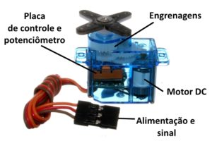
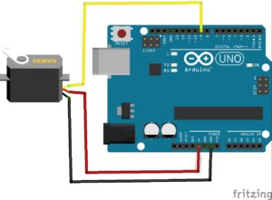

# Controlando Micro Servo 9g com Arduino Uno

# Descrição 
Neste projeto, veremos como realizar o controle de um micro servo através de um arduino UNO

# Pré-requisitos
É nescessário que seja realizada a instalação da IDE do arduino.
# SITE: www.arduino.cc
 
# Matérias 
1 Unidade – Arduino Uno
1 Unidade – Jumper Macho Macho
1 Unidade – Micro Servo 9g
1 Unidade – Chave Philips

# Créditos 
http://blog.baudaeletronica.com.br/micro-servo-9g-com-arduino/

# Adaptado por Vitor Henrique 
